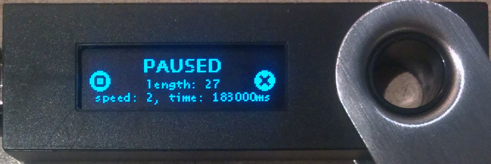

# Ledger Nano S Snake Game Application

This repository contains an implementation of the popular game Snake for the
[Ledger Nano S](https://github.com/LedgerHQ/ledger-nano-s).

The purpose of this app is to demonstrate the capabilities of
[BUI](https://github.com/parkerhoyes/bolos-user-interface), the graphics library
I created as an alternative to the standard BAGL that's a part of the official
SDK. This app makes use of two fonts, Lucida Console 8px and Open Sans Bold
13px, neither of which are currently available through BAGL for the Nano S, as
well as some standard icons that are available from BAGL. The display for this
application is rendered 50 times per second entirely using the BUI API.
Internally, BUI double-buffers the display and manages communications with the
MCU, meaning all the application has to do is render each frame. This is a good
stress-test of the communication link between the MCU which manages peripherals
and the Secure Element onto which applications are loaded.

If you'd like to learn how to use BUI, this application's source code is a good
place to start.

## Game Description

The game involves a snake which the player can turn by pressing the left or
right button and several coins which spawn randomly (up to a maximum of 5 at any
given time). When the snake (which starts out at a length of 7 pixels) eats a
coin, its length increases by 1.

When the snake's length reaches 20, 30, 40, or 50 pixels, it will shrink by 5
pixels but gain speed up to a maximum of five times the starting speed.

Pressing both buttons will pause the game, where you can see various statistics
like the length and speed of the snake as well as the current game duration.

This is quite possibly the smallest version of Snake you will ever play.

## Development Cycle

This repository will follow a Git branching model similar to that described in
[Vincent Driessen's *A successful Git branching
model*](http://nvie.com/posts/a-successful-git-branching-model/) and a
versioning scheme similar to that defined by [Semantic Versioning
2.0.0](http://semver.org/).

## License

This library is distributed under the terms of the very permissive [Zlib
License](https://opensource.org/licenses/Zlib). The exact text of this license
is reproduced in the `LICENSE.txt` file as well as at the top of every source
file in this repository.
